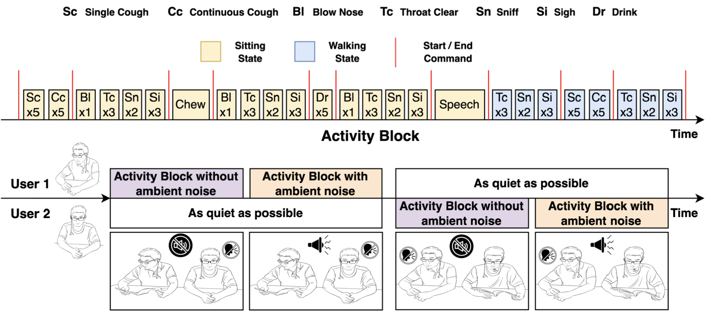
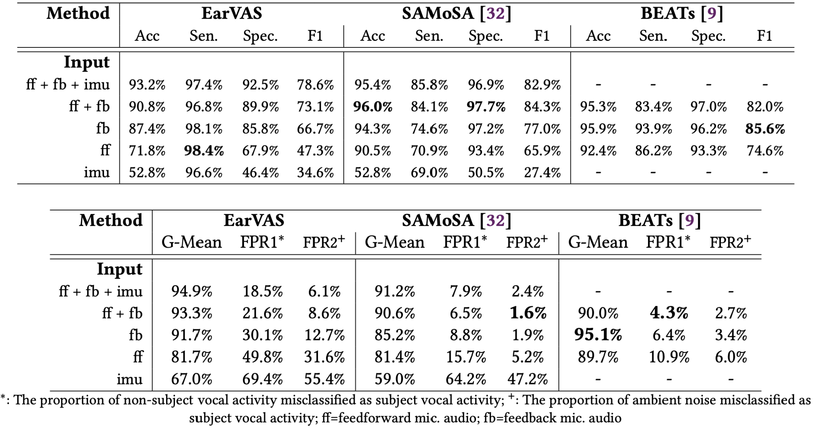
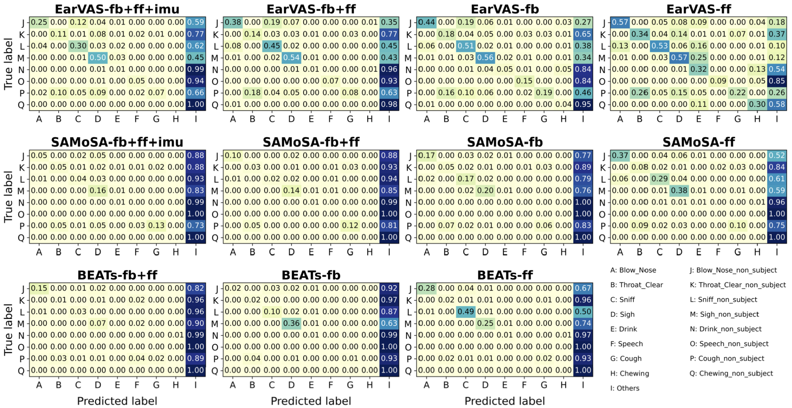
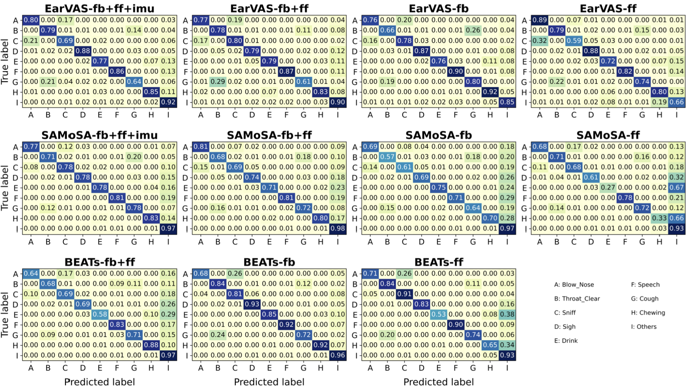

## The EarSAVAS Dataset: Enabling Subject-Aware Vocal Activity Sensing on Earables [IMWUT 2024]

### :book: Abstract

---

EarSAVAS is a publicly available multi-modal dataset crafted for subject-aware human vocal activity sensing on earables, with 44.5 hours of synchronous audio and motion data collected from 42 participants, encompassing 8 different types of human vocal activities. Audio data consists of feed-forward and feedback microphones of active noise-cancelling earables with a sampling rate of 16kHz. IMU data consists of the 3-axis accelerometer data stream and the 3-axis data stream from the gyroscope, with a sampling rate of 100Hz.


The EarSAVAS dataset can be downloaded from [Kaggle](https://www.kaggle.com/datasets/earsavas/earsavas-dataset) now, with data from 42 users available. The description of the structure of our released dataset is listed below. For evaluation of our pre-trained model in EarSAVAS dataset paper, only download the cutted_data directory.


If you have any questions about our work, please feel free to email the author of the paper (zxyx22@mails.tsinghua.edu.cn).

### :computer: Overview of EarSAVAS Dataset

---

#### EarSAVAS Dataset Structure

```
EarSAVAS_Dataset/
├── cutted_data/
│   │
│   ├── user_6_1    # All the data collected from the earables worn by one specific user
│   │   ├── audio/    # All the audio data of one specific user
│   │   │     ├── Cough		 # All the audio data of cough events originated from user_6_1
│   │   │     │     ├── user_6_1_1.wav 		# Audio data file, the numbers behind user_6_1_ hold no specific meaning
│   │   │     │     ├── user_6_1_3.wav
│   │   │     ├── Speech		# All the audio data of speech events originated from user_6_1
│   │   │     ├── Cough_non_subject		 # Cough events originated from user_6_2 but collected by earables of 6_1
│   │   │     ├── Speech_non_subject		# Speech events originated from user_6_2 but collected by earables of 6_1
│   │   │     ├── ...
│   │   └── imu/    # All the motion data of one specific user
│   │         ├── Cough		 # All the motion data of cough events originated from user_6_2
│   │         │     ├── user_6_1_1.pkl 		# IMU data file, the numbers is used to find the corresponding audio file
│   │         │     ├── user_6_1_3.pkl
│   │         ├── Speech		# All the motion data of speech events originated from user_6_1
│   │         ├── Cough_non_subject		 # All the motion data collected while user_6_2 coughs
│   │         ├── Speech_non_subject		# All the motion data collected while user_6_2 speech
│   │         ├── ...											
│   ├── user_15_1
│   ├── user_14_1  
│   ├── user_12_2  
│   ├── user_7_2  
│   ├── user_25_1  
│   ├── user_4_2  
│   ├── user_3_1 
│   └── ...
│
├── raw_data # Raw audio and imu data without segmentation according to the annotation
├── annotation_files # Annotation files containing the start and end time of each event
├── split_channel_cutted_data # Facilitate the listening to the difference between feedback and feedforward audio channel in cutted audio clips on kaggle platform
└── split_channel_raw_audio_data # Facilitate the listening to the difference between feedback and feedforward audio channel in raw audio files for each user on kaggle platform
```

#### Dataset Collection Procedure



We defined ’Activity Block’, a basic unit in which the users perform several groups of activities with the same order and frequency. The groups in Activity Block are separated by the experimenter’s start and end commands. Within the collection process of each pair of participants, one user (such as User 1 in figure) completed the Activity Block with and without ambient noise, while the other participant remain quiet. After User 1 completed the task, the roles are switched with User 2 executing the Activity Block while User 1 remained quiet. The positions of the two participants remained the same as before.

#### Events contained in EarSAVAS Dataset


### :hammer: EarSAVAS Dataset Evaluation via Benchmark Models

---

#### Setup Environment and Prepare Data

**Step 1.** Build a conda environment where the **Python version is 3.8**, then clone and download this repository and set it as the working directory, create a virtual environment, and install the dependencies.

```
cd EarSAVAS/
pip install -r requirements.txt 
```

**Step 2.** Download the EarSAVAS dataset and prepare data for benchmark models training and evaluation.

Download the data from [Kaggle](https://www.kaggle.com/datasets/earsavas/earsavas-dataset) and get the path of the dataset

**Note: the raw_data_dir should be the cutted_data directory under the dataset you downloaded**

```
python3 prep_data.py \
		Dataset.raw_data_dir=absolute_path_of_data 	  		        	   
		Dataset.dataset_dir=absolute_path_where_you_want_to_keep_the_proposed_dataset
```

**Step 3.** Prepare the data for SAMoSA evaluation.

```
python3 SAMoSA_data_prepare.py \
		Dataset.dataset_dir=the_dataset_dir_you_set_on_the_step2
```

#### Train the EarVAS/SAMoSA benchmark model

Run the train script `EarVAS_main.py`

```
python3 EarVAS_main.py \
		Dataset.dataset_dir=absolute_path_of_where_you_store_dataset_files_in_step_2 \
		Model.exp_dir=absolute_path_where_you_want_to_save_experiment_results \
		Model.task=$task \
		Model.device=$device \
		Model.samosa=True/False
```

The model task can be only selected from [two_channel_audio_and_imu, two_channel_audio, feedforward_audio, feedback_audio, imu_only, feedback_audio_and_imu, feedforward_audio_and_imu]

We use the samosa to select the training of EarVAS or SAMoSA model respectly. For example, if the Model.task=two_channel_audio_and_imu and the Model.samosa=False, then you train EarVAS model with two-channel audio and motion data as input. However, if the Model.samosa=True, then you train SAMoSA model with the same input modalities.

#### Evaluate our pre-trained EarVAS/SAMoSA benchmark model locally

**Step 1.** Download the pre-trained models from [Google Drive](https://drive.google.com/drive/folders/1vl1WPxoQwXeZxO-3kNq7vux-Gk5TM3PQ)


**Step 2.** Run the evaluation of our best models of EarVAS series models.

```
python3 EarVAS_evaluation.py \
	Dataset.dataset_dir=absolute_path_of_where_you_store_dataset_files_in_step_2 \
	Model.exp_dir=absolute_path_where_you_download_the_pretrained_models \
	Model.task=$task \
	Model.device=$device \
	Model.samosa=True/False
```

The model task can be only selected from [two_channel_audio_and_imu, two_channel_audio, feedforward_audio, feedback_audio, imu_only, feedback_audio_and_imu, feedforward_audio_and_imu]

We use the samosa to select the evaluation on EarVAS or SAMoSA. For example, if the Model.task=two_channel_audio_and_imu and the Model.samosa=False, then you evaluate the performance of EarVAS with two-channel audio and motion data as input. However, if the Model.samosa=True, then you evaluate the performance of SAMoSA with the same input modalities.

The model device can be only selected from [cpu, cuda]. **We recommend evaluating our pre-trained models on the CPU. If the device is selected as cuda, then please ensure that the version of your CUDA is 12.2.** Otherwise, the results will differ from those reported in the original paper. 

#### Train and evaluate BEATs benchmark model on EarSAVAS dataset

Please enter the `BEATs_on_EarSAVAS` directory and operate according to the Readme file.

### :pencil: Benchmark Model Performance on EarSAVAS

---

#### Binary Classification: Distinguish subject vocal activity from interfering events





**Note**: numerical values presented in figure represent the proportions of specific non-subject vocal activities that are either misidentified as subject vocal activities (left eight columns) or accurately classified into the 'others' category (rightmost column).

#### Multi-class Classification: Fine-grained subject-aware vocal activity recognition performance




### :page_with_curl: Citation

```
@article{10.1145/3659616,
author = {Zhang, Xiyuxing and Wang, Yuntao and Han, Yuxuan and Liang, Chen and Chatterjee, Ishan and Tang, Jiankai and Yi, Xin and Patel, Shwetak and Shi, Yuanchun},
title = {The EarSAVAS Dataset: Enabling Subject-Aware Vocal Activity Sensing on Earables},
year = {2024},
issue_date = {May 2024},
publisher = {Association for Computing Machinery},
address = {New York, NY, USA},
volume = {8},
number = {2},
url = {https://doi.org/10.1145/3659616},
doi = {10.1145/3659616},
journal = {Proc. ACM Interact. Mob. Wearable Ubiquitous Technol.},
month = {may},
articleno = {83},
numpages = {26},
keywords = {Active Noise Cancelling Earables, Dataset, Deep Learning, Human Vocal Activity Recognition, Subject Awareness}
}
```